# Projeto Pokémon com PokéAPI

## Projeto proposto pelo curso de desenvolvimento full stack DevQuest, com o obejtivo de praticar tudo o que foi passado até aqui.

## Tecnologias presentes:

###          ;
### [ PokeAPI ](https://pokeapi.co/);
### [ Styled Components ](https://styled-components.com );
### [ React Router ](https://reactrouter.com/en/main);
### [React Testing library](https://testing-library.com/docs/react-testing-library/intro/);

## Apresentando o projeto:

### Home:
No topo da Home encontra-se um simples menu, com a logo do anime Pokémon, e paralelo a ela o botão para alternar o tema.

Em seguida, já na seção dos cards, vemos uma barra de ferramentas. Onde encontra-se a filtragem por tipo de Pokémon, e do outro lado a barra de pesquisa, para pesquisar por **nome de um Pokemon**.

Essa barra de pesquisa possúi um algorítmo que possibilita uma pesquisa mais "facilitada", fazendo com que possa ser encontrado o pekémon desejado mesmo sem digitar o nome exato ou completo do Pokemón, que aparecerão os nomes mais próximos.

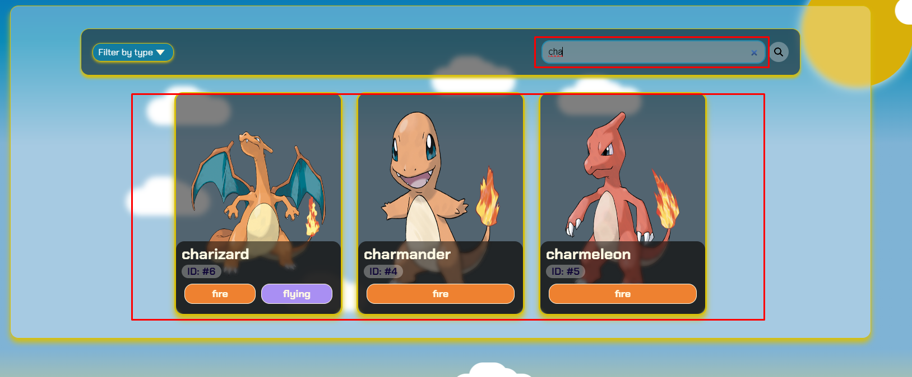

Caso o usuário digite algo inválido na barra de pesquisa, irá aparecer uma mensagem de erro informando o ocorrido.

Na parte onde ficam os cards inicialmente lhe mostra-rá uma listagem com 10 Pokémons. E logo abaixo você verá um botão `Show more`, que carregará mais 10 Pokémons com suas respectivas informações iniciais.

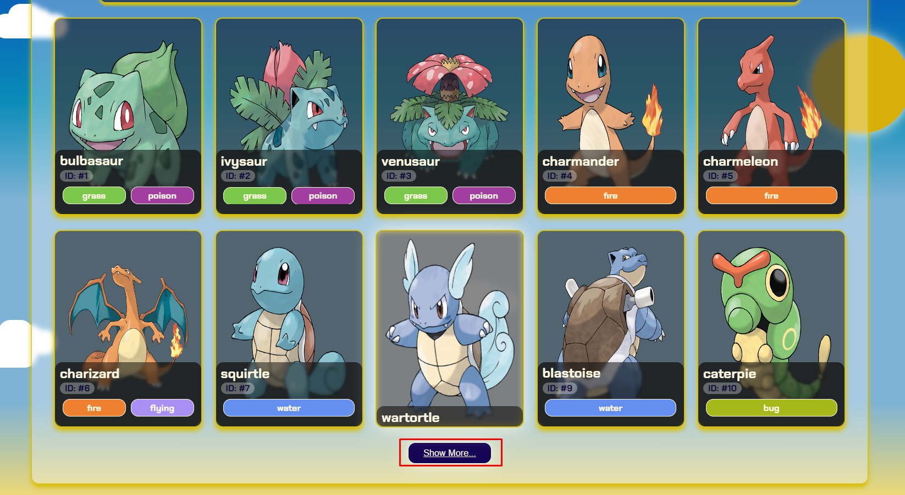

Vale ressaltar que esses valores podem ser alterados nos arquivos do projeto, na pasta `variables` em `./src/js/variables`, nas variáveis `listDefaultValue` e `moreToshow`.

## Página de Infos sobre um Pókemon:

Ao Clicar em um Pokémon, abrirá uma página contendo inforamções mais detalhadas sobre o mesmo. Sendo elas:
 - Nome; 
 - Id;
 - Imagem Oficial;
 - Estatísticas;
 - Peso;
 - Tipo ou Tipos do Pokémon;
 - Altura;
 - Experiência Base;
 - Habilidades do Pokémon, contendo nome e sua respectiva descrição;
 - Lista de Movimentos, contendo nome e sua respectiva descrição;
 - Uma versão em miniatura da seção de Cards presente na Home.

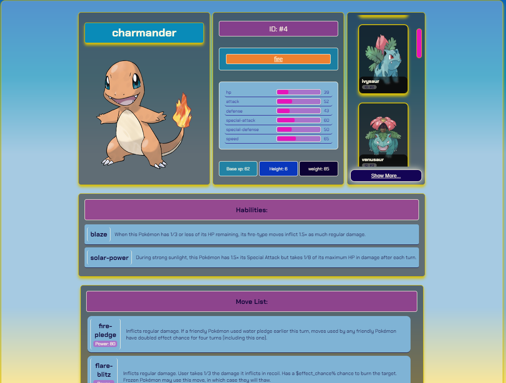

Observe que a parte onde mostra o tipo/tipos do Pokémon, também é um botão. Que faz a filtragem por tipo também nessa página.

## Personalização do projeto:

O projeto usa a biblioteca Styled Components, o que possibilita personalizar cada componente de uma maneira mais fácil e organizada. Os componentes estilizados, encontran-se em *src/styled-components* .
Nesse mesmo diretório encontra-se também, o componente estilizado dos backgrounds de cada tema. Sendo possível também estizá-los de maneiras diferentes. 

Para uma personalização mais geral, podemos ir em *src/js/objects*. Onde podemos encontrar as cores dos tipos de Pokémons existentes, contendo nome e hexadecimal. E logo abaixo um objeto contendo a definição de cores para componentes que mudam de cor de acordo com o tema. Sendo possível personalizar à gosto. 

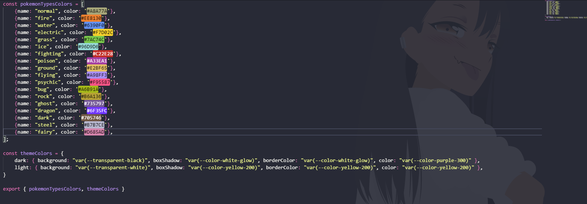

### O Projeto está 100% responsivo, se ajustando em telas de diferentes tamanhos. 

## Capturas de tela:

### Desktop:

Home:
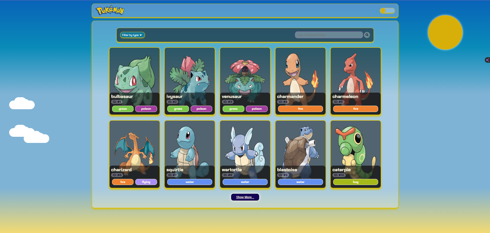
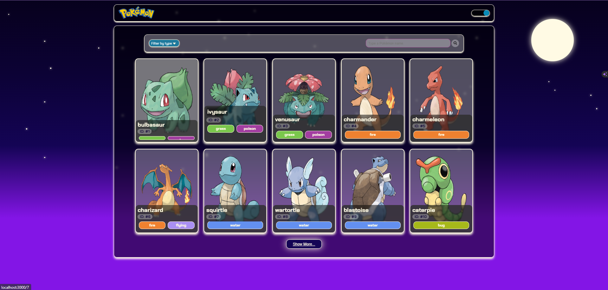

Pokemon Infos: 
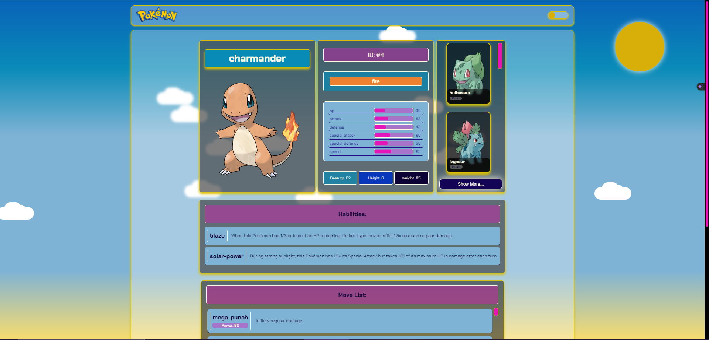
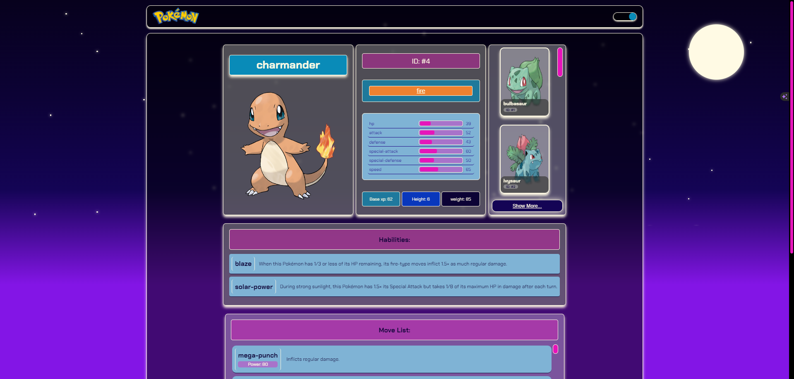

### Mobile:

Home:
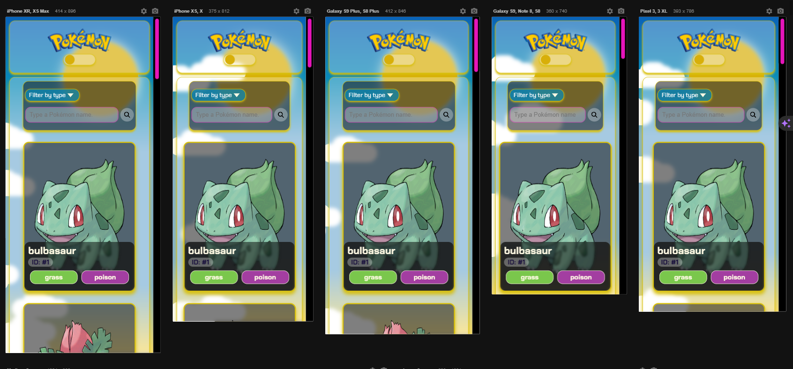
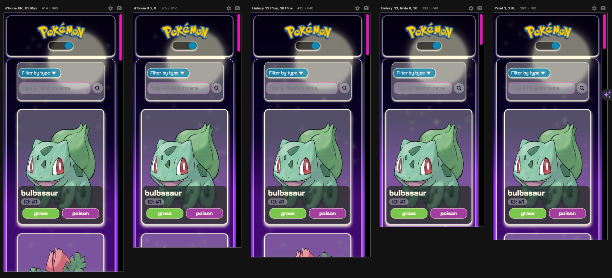

Pokemon Infos: 
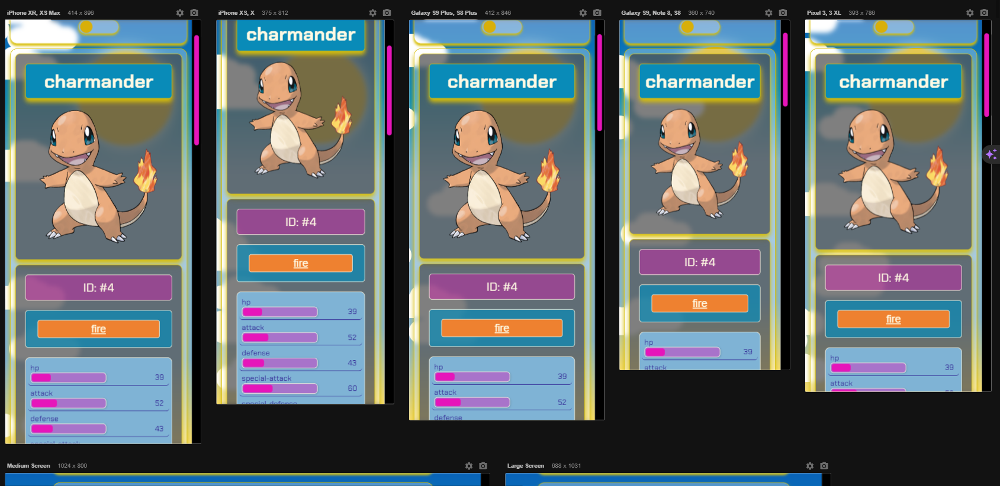
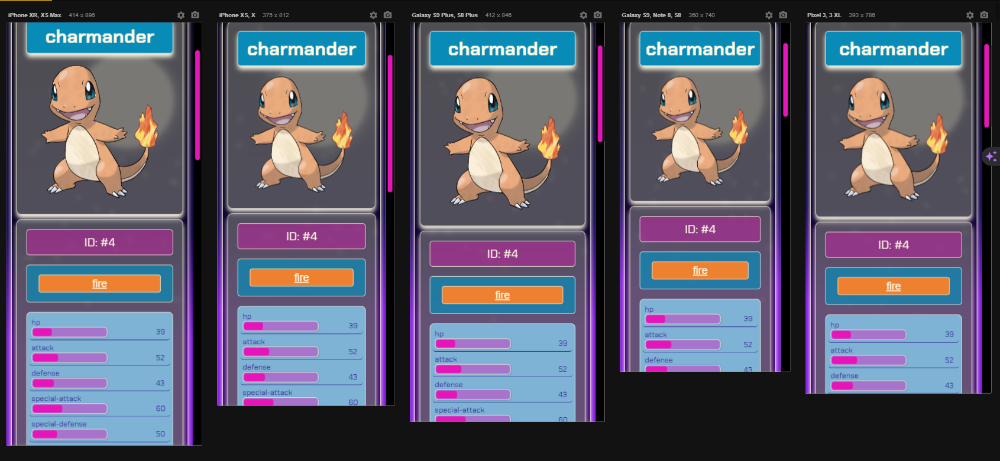

## Feito com muito amor 💙. Espero que gostem 😊!!!